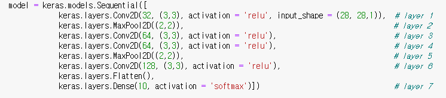
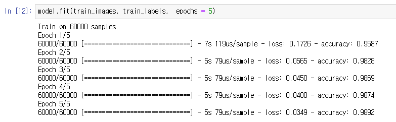
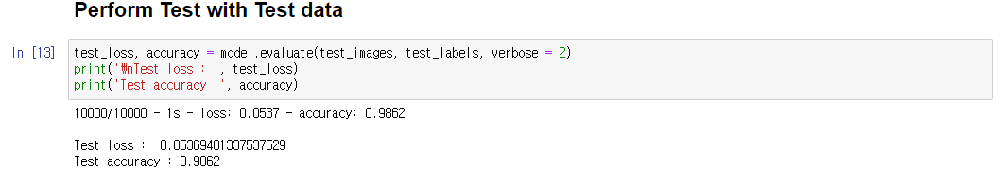
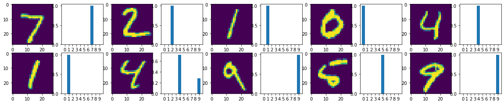
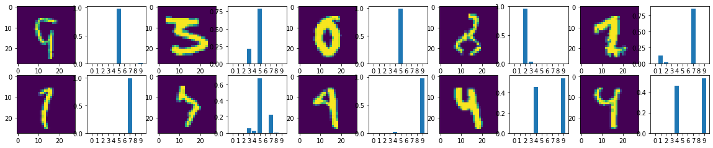

# Algorithm_03

## Model
### Model with 4 CNN layer

### Train with Adam optimizer
#### epoch is 5

### Test Accuracy
#### Results
|         | Accuracy |
|:-------:|:--------:|
| Model 1 |   97.36  |
| Model 2 |   98.59  |
| Model 3 |   98.62  |  

(train image of model 3)  

### Success images and corresponding probability

### Failure images and corresponding probability

